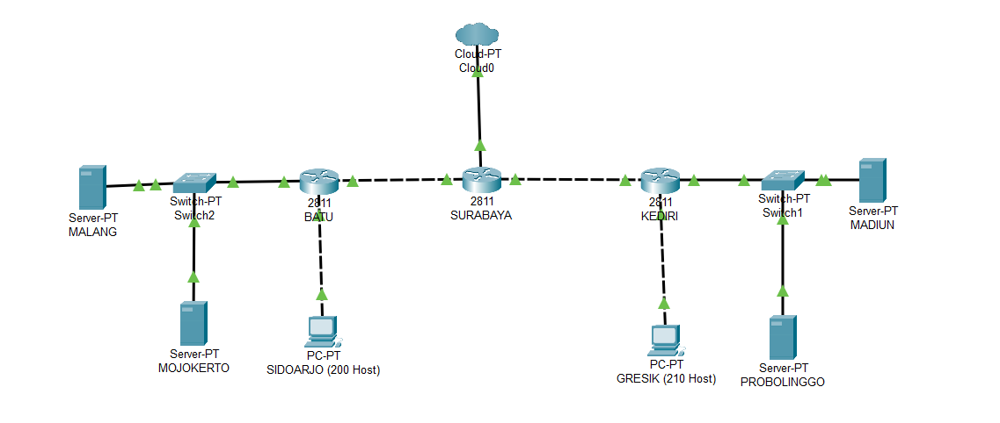
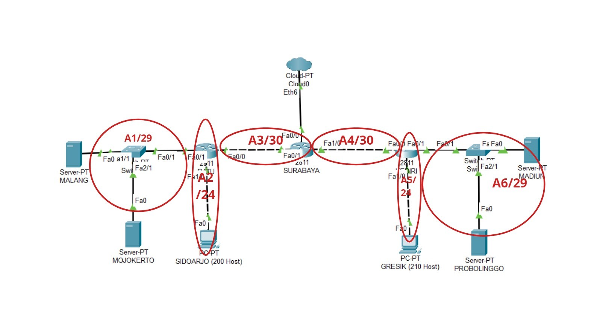
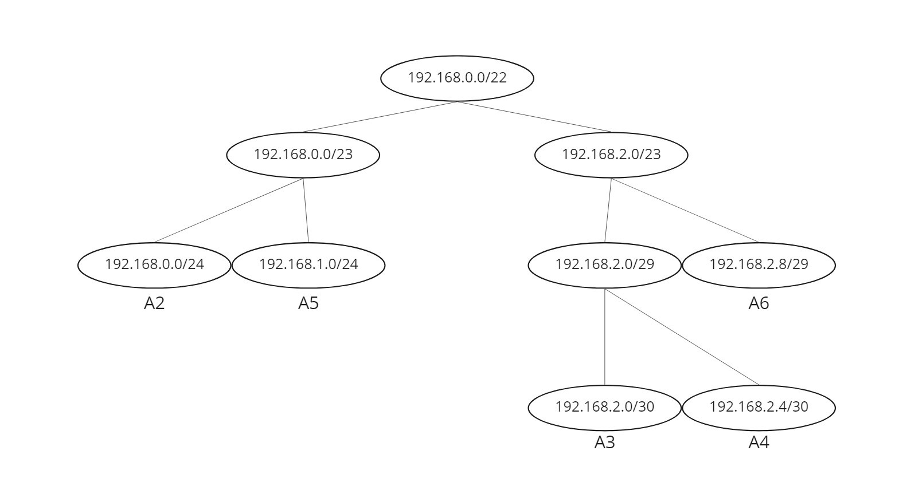

## Lapres Jarkom Modul5 Kelompok T08
### Anggota Kelompok :
1. Kadek Nesya Kurniadewi (05311840000009)
2. Agung Mulyono (05311840000035)

### A. Topologi Jaringan

### B. Menggunakan Metode VLSM
+ Pembagian Subnet <br>

+ Pembagian IP <br>

**Catatan**: Untuk Subnet A1 menggunakan NID DMZ yaitu **10.151.83.144/29**
### C. Routing
### D. DHCP
+ DHCP Relay
  - Install DHCP relay pada router **BATU** dan **KEDIRI** dengan menggunakan perintah <br>`apt-get install isc-dhcp-relay`
  - Isikan IP MOJOKERTO sebagai destinasi DHCP server
  - Buka file konfigurasi interface pada router **BATU** dan **KEDIRI** dengan menggunakan perintah <br>`nano /etc/default/isc-dhcp-relay`
  - router **BATU**<br> 
    Pada bagian INTERFACES isikan eth1 eth2 <br>`INTERFACES="eth1 eth2"`
  - router **KEDIRI**<br>
    Pada bagian INTERFACES isikan eth0 eth2 <br> `INTERFACES="eth0 eth2"
+ DHCP Server
  - Install DHCP server pada server **MOJOKERTO** dengan menggunakan perintah `apt-get install isc-dhcp-server`
  - Buka file konfigurasi interface pada server **MOJOKERTO** dengan menggunakan perintah <br>`nano /etc/default/isc-dhcp-server`
  - Pada bagian INTERFACESv4 isikan eth0 <br>`INTERFACESv4="eth0"
  - Setelah itu edit file konfigurasi `nano /etc/dhcp/dhcpd.conf`
  ```
  #NID DMZ
  subnet 10.151.83.144 netmask 255.255.255.248 {}
  
  #Subnet Sidoarjo
  subnet 192.168.0.0 netmask 255.255.255.0 {
    range 192.168.0.5 192.168.0.215;
    option routers 192.168.0.1;
    option broadcast-address 192.168.0.255;
    option domain-name-servers 10.151.83.146;
    default-lease-time 300;
    max-lease-time 7200;
   }
  
  #Subnet Gresik
  subnet 192.168.1.0 netmask 255.255.255.0 {
    range 192.168.1.5 192.168.1.215;
    option routers 192.168.1.1;
    option broadcast-address 192.168.1.255;
    option domain-name-servers 10.151.83.146;
    default-lease-time 300;
    max-lease-time 7200;
  }
  ```
  - Setelah itu restart DHCP server `service isc-dhcp-server restart`
+ Ubah interface pada client **GRESIK** dan **SIDOARJO**
```
auto lo
iface lo inet loopback

auto eth0
iface eth0 inet dhcp
```
### Soal no 1 :
Agar topologi yang kalian buat dapat mengakses keluar, kalian diminta untuk mengkonfigurasi
SURABAYA menggunakan iptables, namun Bibah tidak ingin kalian menggunakan
MASQUERADE.
```
iptables -t nat -A POSTROUTING -s 192.168.0.0/16 -o eth0 -j SNAT --to-source 10.151.74.74 #surabaya 
```

### Soal no 2 :
Kalian diminta untuk mendrop semua akses SSH dari luar Topologi (UML) Kalian pada server
yang memiliki ip DMZ (DHCP dan DNS SERVER) pada SURABAYA demi menjaga keamanan.
```
iptables -A FORWARD -d 10.151.83.144/29 -i eth0 -p tcp --dport 22 -j DROP #surabaya
```

### Soal no 3 :
Karena tim kalian maksimal terdiri dari 3 orang, Bibah meminta kalian untuk membatasi DHCP
dan DNS server hanya boleh menerima maksimal 3 koneksi ICMP secara bersamaan yang berasal dari
mana saja menggunakan iptables pada masing masing server, selebihnya akan di DROP.
```
iptables -A INPUT -p icmp -m connlimit --connlimit-above 3 --connlimit-mask 0 -j DROP #malang dan mojokerto
```

### Soal no 4 :
Akses dari subnet SIDOARJO hanya diperbolehkan pada pukul 07.00 - 17.00 pada hari Senin
sampai Jumat.
```
iptables -A INPUT -s 192.168.0.0/24 -m time --timestart 07:00 --timestop 17:00 --weekdays Mon,Tue,Wed,Thu,Fri -j ACCEPT
iptables -A INPUT -s 192.168.0.0/24 -j REJECT #malang
```

### Soal no 5 :
Akses dari subnet GRESIK hanya diperbolehkan pada pukul 17.00 hingga pukul 07.00 setiap
harinya.
```
iptables -A INPUT -s 192.168.1.0/24 -m time --timestart 06:59 --timestop 16:59 -j REJECT #malang
```

### Soal no 6 :
Karena kita memiliki 2 buah WEB Server, Bibah ingin SURABAYA disetting sehingga setiap
request dari client yang mengakses DNS Server akan didistribusikan secara bergantian pada
PROBOLINGGO port 80 dan MADIUN port 80.
```
#surabaya
iptables -t nat -A PREROUTING -p tcp -d 10.151.83.146 -m statistic --mode nth --every 2 --packet 0 -j DNAT --to-destination 192.168.2.11:80
iptables -t nat -A PREROUTING -p tcp -d 10.151.83.146 -j DNAT --to-destination 192.168.2.10:80
```

### Soal no 7 :
Bibah ingin agar semua paket didrop oleh firewall (dalam topologi) tercatat dalam log pada setiap
UML yang memiliki aturan drop.
```
#surabaya
iptables -N LOGGING
iptables -A FORWARD -j LOGGING
iptables -A OUTPUT -j LOGGING
iptables -A LOGGING -j LOG --log-prefix "IPTables-Dropped: " --log-level 4
iptables -A LOGGING -j DROP

#malang
iptables -N LOGGING
iptables -A INPUT -j LOGGING
iptables -A OUTPUT -j LOGGING
iptables -A LOGGING -j LOG --log-prefix "IPTables-Dropped: " --log-level 4
iptables -A LOGGING -j DROP

#mojokerto
iptables -N LOGGING
iptables -A INPUT -j LOGGING
iptables -A OUTPUT -j LOGGING
iptables -A LOGGING -j LOG --log-prefix "IPTables-Dropped: " --log-level 4
iptables -A LOGGING -j DROP
```
